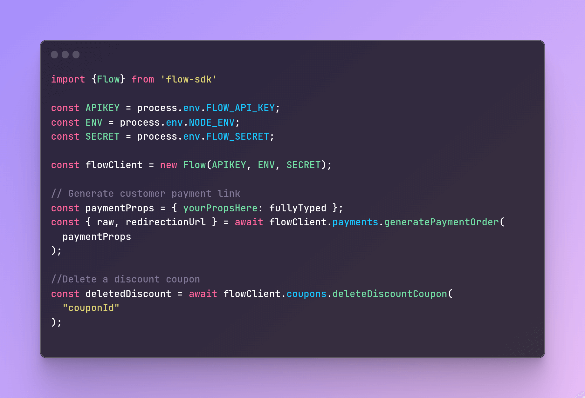

## Flow SDK

Unofficial [but wonderful] heavily typed NodeJS Flow SDK to ease your integrations with Flow payment gateway.



## Installation

Install flow-sdk in your project

```bash
  npm install flow-sdk-ts
  # or
  yarn add flow-sdk-ts
```

## Usage/Examples

```typescript
import { Flow } from "flow-sdk";

const APIKEY = process.env.FLOW_API_KEY;
const ENV = process.env.NODE_ENV;
const SECRET = process.env.FLOW_SECRET;

const flowClient = new Flow(APIKEY, ENV, SECRET);

// Generate customer payment link
const paymentProps = { yourPropsHere: fullyTyped };

const { raw, redirectionUrl } = await flowClient.payments.generatePaymentOrder(
  paymentProps
);

//Delete a discount coupon
const deletedDiscount = await flowClient.coupons.deleteDiscountCoupon(
  "couponId"
);
```

## Authors and Contributors

- [@MikaGaete](https://github.com/MikaGaete)
