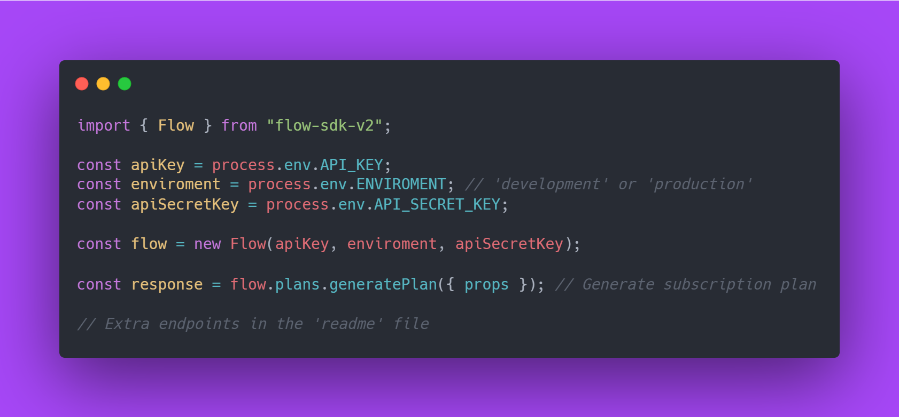

# Flow SDK v2

Welcome to the new version of the 'flow-sdk', designed to simplify your experience
of accepting payments, generating plans, enrolling subscribers and more. In the
next image you can see a short example of how to use the 'flow-sdk-v2' package: 



## Installation

The 'flow-sdk-v2' package can be installed via npm and yarn, executing one of the
following commands:

```bash
  npm install flow-sdk-ts
  # or
  yarn add flow-sdk-ts
```

## Clients and methods

Before we list all the clients and their respective methods methods you can read
the official flow documentation in the following [link](https://www.flow.cl/docs/api.html)
to get more information.

### Payment client

Allows the management of regular payments or email payments.

#### Available methods

- *getPaymentOrderStatus()*: Retrieves the status of a payment order.
- *getExtendedPaymentOrderStatus()*: Retrieves the extended status of a payment order.
- *getPaymentOrderStatusByFlowOrder()*: Retrieves the extended status of a payment order by flow order.
- *getExtendedPaymentOrderStatusByFlowOrder()*: Retrieves the extended status of a payment order by flow order.
- *getPaymentOrderStatusByCommerceId()*: Retrieves the status of a payment order by commerce ID.
- *generatePaymentOrder()*: Generates a new payment order based on the provided properties.

### Refund client

Allows the management of refund orders.

#### Available methods

- *generateRefund()*: Generates a refund for a payment based on the provided properties.
- *cancelRefund()*: Cancels a refund with the given token.
- *getRefundStatus()*: Retrieves the status of a refund with the given token.

#### Example

```javascript
  const response = flow.refunds.desiredMethod(props);
```

### Customer client

Allows the creation of clients to make recurring charges or subscribe them to
subscription plans.

#### Available methods

- *generateCustomer()*: Creates a new customer.
- *editCustomer()*: Edits an existing customer's information.
- *deleteCustomer()*: Deletes a customer.
- *getClient()*: Retrieves a customer's information.
- *getCustomersList()*: Retrieves a list of customers based on filters.
- *generateRegisterLink()*: Generates a registration card link for a customer.
- *getRegisterStatus()*: Retrieves the registration card status of a customer.
- *unRegisterCustomer()*: Unregisters a customer's card.
- *chargeCustomersCreditCard()*: Charges a customer's credit card.
- *chargeCustomer()*: Charges a customer.
- *batchChargeCustomers()*: Batch charges multiple customers.
- *getBatchChargeStatus()*: Retrieves the status of a batch charge.
- *reverseCharge()*: Reverses a customer charge.
- *getCustomerCharges()*: Retrieves a list of charges for a customer.
- *getCustomerChargeAttempts()*: Retrieves a list of charge attempts for a customer.
- *getCustomerSubscriptions()*: Retrieves a list of subscriptions for a customer.

#### Example

```javascript
  const response = flow.customers.desiredMethod(props);
```

### Plan client

Management of subscription plans.

#### Available methods

- *generatePlan()*: Generates a subscription plan.
- *getPlanDetails()*: Retrieves details of a subscription plan.
- *editPlanDetails()*: Edits details of a subscription plan.
- *deletePlan()*: Deletes a subscription plan.
- *listPlans()*: Lists plans based on provided properties.

#### Example

```javascript
  const response = flow.plans.desiredMethod(props);
```

### Subscription client

Allows the subscription of clients to plans.

#### Available methods

- *generateSubscription()*: Creates a new subscription.
- *getSubscription()*: Retrieves a subscription by its ID.
- *getSubscriptions()*: Retrieves a list of subscriptions based on filters.
- *changeTrialDays()*: Changes the trial period days of a subscription.
- *cancelSubscription()*: Cancels a subscription.
- *addDiscountCoupon()*: Adds a discount coupon to a subscription.
- *deleteDiscountCoupon()*: Deletes a discount coupon from a subscription.

#### Example

```javascript
  const response = flow.subscriptions.desiredMethod(props);
```

### Coupon client

Allows the creation of discount coupons to be applied on subscriptions or costumers.

#### Available methods

- *generateDiscountCoupon()*: Generates a new discount coupon.
- *editDiscountCoupon()*: Edits an existing discount coupon.
- *deleteDiscountCoupon()*: Deletes a discount coupon by its ID.
- *getDiscountCoupon()*: Retrieves a discount coupon by its ID.
- *getListOfDiscountCoupons()*: Retrieves a list of discount coupons based on filters.

#### Example

```javascript
  const response = flow.coupons.desiredMethod(props);
```

### Invoice client

Allows the retrieval of the payments generated through subscriptions.

#### Available methods

- *getInvoice()*: Retrieves an invoice by its ID.
- *getOverDueInvoices()*: Retrieves a list of overdue invoices based on provided filters.
- *cancelInvoice()*: Cancels an invoice by its ID.
- *outsidePayment()*: Records an outside payment for an invoice.
- *retryToCollectInvoice()*: Retries to collect payment for an invoice.

#### Example

```javascript
  const response = flow.invoices.desiredMethod(props);
```

### Settlement client

Allows to retrieve the liquidations of payments made by Flow.

#### Available methods

- *getSettlements()*: Retrieves a list of settlements based on the provided filters.
- *getSettlement()*: Retrieves details of a specific settlement by its ID.

#### Example

```javascript
  const response = flow.settlements.desiredMethod(props);
```

### Merchant client

Allows the management of associated businesses.

#### Available methods

- *generateAssociatedCommerce()*: Creates a new associated commerce.
- *editAssociatedCommerce()*: Edits an existing associated commerce.
- *deleteAssociatedCommerce()*: Deletes an associated commerce by its ID.
- *getAssociatedCommerce()*: Retrieves an associated commerce by its ID.
- *getListOfAssociatedCommerces()*: Retrieves a list of associated commerces based on filters.

#### Example

```javascript
  const response = flow.merchants.desiredMethod(props);
```

## Author

- [@MikaGaete](https://github.com/MikaGaete)
