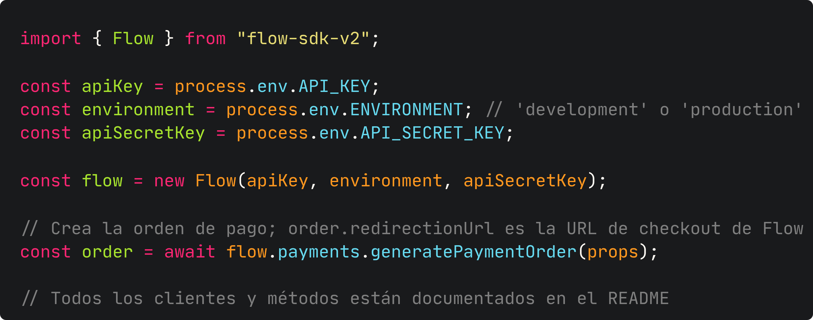

# Flow SDK v2

SDK de TypeScript (no oficial) para la API REST de [Flow](https://www.flow.cl),
la pasarela de pagos chilena. Envuelve la API detrás de clientes tipados por
recurso —pagos, reembolsos, clientes, planes, suscripciones, ítems adicionales,
cupones, importes, liquidaciones y comercios asociados— y firma cada petición
por ti.



> **Sólo para el servidor.** El SDK firma las peticiones con tu *secret key* de
> comercio usando el módulo `crypto` de Node. No debe empaquetarse para el
> navegador: no funcionaría sin polyfill y, sobre todo, expondría tu secreto.

## Instalación

```bash
npm install flow-sdk-v2
# o
yarn add flow-sdk-v2
```

Requiere una versión de Node con `fetch` global (18 o superior).

## Autenticación y entornos

Todas las peticiones llevan `apiKey` y una firma `s` (HMAC-SHA256 sobre los
parámetros ordenados alfabéticamente). El SDK las agrega y calcula por ti; sólo
necesitas construir el cliente con tus credenciales:

```ts
import { Flow } from 'flow-sdk-v2'

// env: 'development' apunta a sandbox.flow.cl, 'production' a www.flow.cl
const flow = new Flow(process.env.FLOW_API_KEY, 'development', process.env.FLOW_SECRET)
```

| `env` | Base URL |
|---|---|
| `'development'` | `https://sandbox.flow.cl/api` |
| `'production'` | `https://www.flow.cl/api` |

Desde ahí, cada recurso es un cliente (`flow.payments`, `flow.subscriptions`,
`flow.refunds`, …) y casi todos sus métodos son asíncronos. La lista completa
está más abajo, en [Clientes y métodos](#clientes-y-métodos).

## Manejo de errores

- **`FlowError`** — los parámetros no cumplen el esquema del método. Se lanza
  antes de hacer cualquier petición de red; el mensaje indica qué campo falló.
- **`FlowHTTPError`** — Flow respondió con un código fuera del rango 2xx. Expone
  `code` (código de error de Flow), `message` y `url`.

```ts
import { FlowHTTPError } from 'flow-sdk-v2'

try {
    await flow.refunds.getRefundStatus(token)
}
catch (error) {
    if (error instanceof FlowHTTPError) {
        console.error(error.code, error.message)
    }
}
```

## Webhooks

Al crear una orden de pago, Flow envía un `POST` a tu `urlConfirmation` cuando el
pagador actúa sobre ella (y a `urlCallBack` en reembolsos y cobros por lote). Ese
callback lleva **sólo** un campo `token`, **no está firmado**, y Flow espera un
`200` rápido. Como no puedes verificar su origen ni deducir el resultado del
`token`, trátalo únicamente como disparador: al recibirlo, llama a
`getPaymentOrderStatus(token)` (o `getRefundStatus(token)`) para leer el estado
verificado antes de actualizar tus registros.

## Clientes y métodos

Consulta la [documentación oficial de Flow](https://developers.flow.cl/) para el
detalle de cada operación. El contrato que este SDK modela se deriva del spec
OpenAPI publicado por Flow (`openspec/reference/flow-openapi.yaml`).

### `flow.payments` — Pagos

- **`generatePaymentOrder(props)`** — crea una orden de pago y devuelve
  `redirectionUrl` más la respuesta cruda. `props.timeout` está en **segundos**;
  si se omite, la orden no expira.
- **`generateEmailPayment(props)`** — genera un cobro que Flow envía al pagador
  por email, con el enlace de pago incluido.
- **`getPaymentOrderStatus(token)`** / **`getExtendedPaymentOrderStatus(token)`** —
  estado simple / extendido (datos de tarjeta y último intento) por token.
- **`getPaymentOrderStatusByFlowOrder(flowOrder)`** — estado simple por número de
  orden de Flow (numérico, no token).
- **`getExtendedPaymentOrderStatusByFlowOrder(flowOrder)`** — estado extendido
  por número de orden de Flow.
- **`getPaymentOrderStatusByCommerceId(commerceId)`** — estado por identificador
  de comercio.
- **`getPayments({ date, start?, limit? })`** — lista paginada de pagos recibidos
  en un día (`date` en `yyyy-mm-dd`).
- **`getTransactions({ date, start?, limit? })`** — lista paginada de
  transacciones de un día (operación distinta de `getPayments`).

### `flow.refunds` — Reembolsos

- **`generateRefund(props)`** — crea una orden de reembolso. `commerceTrxId` y
  `flowTrxId` (ambos opcionales) identifican la transacción original.
- **`cancelRefund(token)`** — cancela un reembolso pendiente.
- **`getRefundStatus(token)`** — consulta el estado de un reembolso.

### `flow.customers` — Clientes

- **`generateCustomer(props)`** / **`editCustomer(props)`** / **`deleteCustomer(customerId)`**
- **`getClient(customerId)`** — datos de un cliente.
- **`getCustomersList(filter?)`** — lista paginada de clientes.
- **`generateRegisterLink(props)`** — enlace para que el cliente registre su
  tarjeta; **`getRegisterStatus(token)`** consulta el resultado;
  **`unRegisterCustomer(customerId)`** la elimina.
- **`chargeCustomersCreditCard(props)`** — cargo automático a la tarjeta
  registrada.
- **`chargeCustomer(props)`** — envía un cobro (cargo automático, link de pago o
  email según el cliente).
- **`batchChargeCustomers(props)`** / **`getBatchChargeStatus(token)`** — cobros
  masivos y su estado.
- **`reverseCharge({ commerceOrder?, flowOrder? })`** — reversa un cargo (dentro
  de 24 h). Se identifica por cualquiera de los dos.
- **`getCustomerCharges(customerId, filter?)`** — lista de cargos de un cliente.
- **`getCustomerChargeAttempts(customerId, filter?)`** — lista de intentos de
  cargo fallidos.
- **`getCustomerSubscriptions(customerId, filter?)`** — lista de suscripciones de
  un cliente.

### `flow.plans` — Planes de suscripción

- **`generatePlan(props)`** / **`editPlanDetails(props)`** / **`deletePlan(planId)`**
- **`getPlanDetails(planId)`** — datos de un plan.
- **`listPlans(filter?)`** — lista paginada de planes.

### `flow.subscriptions` — Suscripciones

- **`generateSubscription(props)`** — suscribe un cliente a un plan.
- **`getSubscription(subscriptionId)`** — datos de una suscripción.
- **`getSubscriptions(planId, filter?)`** — lista de suscripciones de un plan.
  `planId` es obligatorio.
- **`changeTrialDays({ subscriptionId, trialPeriodDays })`** — modifica los días
  de trial.
- **`cancelSubscription({ subscriptionId, atPeriodEnd? })`** — cancela; con
  `atPeriodEnd: 1` al final del período, `0` (o al omitirlo) de inmediato.
- **`addDiscountCoupon({ subscriptionId, couponId })`** /
  **`deleteDiscountCoupon(subscriptionId)`** — descuento de la suscripción.
- **`addItem({ subscriptionId, itemId, quantity? })`** — agrega un ítem
  adicional. Omitir `quantity` deja que Flow aplique su valor por defecto (1).
- **`updateItem({ subscriptionId, itemId, quantity })`** — cambia la cantidad de
  un ítem adicional.
- **`deleteItem({ subscriptionId, itemId })`** — quita un ítem adicional.
- **`changePlan({ subscriptionId, newPlanId, startDateOfNewPlan? })`** — cambia
  el plan de la suscripción.
- **`previewPlanChange({ subscriptionId, newPlanId, startDateOfNewPlan? })`** —
  previsualiza el efecto de un cambio de plan sin aplicarlo.
- **`cancelPlanChange(subscriptionId)`** — cancela un cambio de plan programado.

### `flow.subscriptionItems` — Ítems adicionales

Catálogo de cargos que se pueden aplicar sobre una suscripción por encima de su
plan base.

- **`createItem({ name, currency, amount })`** — crea un ítem (`amount` negativo
  es un descuento, positivo un recargo).
- **`getItem(itemId)`** — datos de un ítem.
- **`editItem({ itemId, name?, amount?, changeType? })`** — edita un ítem.
  `changeType` (`to_future` | `all`) es obligatorio si se envía `name` o `amount`.
- **`deleteItem({ itemId, changeType })`** — da de baja un ítem.
- **`listItems(filter?)`** — lista paginada de ítems.

### `flow.coupons` — Cupones de descuento

- **`generateDiscountCoupon(props)`** / **`editDiscountCoupon(props)`** /
  **`deleteDiscountCoupon(couponId)`**
- **`getDiscountCoupon(couponId)`** — datos de un cupón.
- **`getListOfDiscountCoupons(filter?)`** — lista paginada de cupones.

### `flow.invoices` — Importes (facturas de suscripción)

- **`getInvoice(invoiceId)`** — datos de un importe.
- **`getOverDueInvoices(filter?)`** — importes vencidos.
- **`cancelInvoice(invoiceId)`** — anula un importe pendiente.
- **`outsidePayment(props)`** — registra un pago recibido fuera de Flow.
- **`retryToCollectInvoice(invoiceId)`** — reintenta el cobro de un importe
  vencido.

### `flow.settlement` — Liquidaciones

- **`getSettlements({ startDate, endDate, currency? })`** — liquidaciones en un
  rango de fechas (Flow exige que el rango sea menor a 30 días).
- **`getSettlement(id)`** — detalle de una liquidación (resumen y movimientos).

### `flow.merchants` — Comercios asociados

- **`generateAssociatedCommerce(props)`** / **`editAssociatedCommerce(props)`** /
  **`deleteAssociatedCommerce(id)`**
- **`getAssociatedCommerce(id)`** — datos de un comercio asociado.
- **`getListOfAssociatedCommerces(filter?)`** — lista paginada.

## Migración

### a la 2.1

- **`generatePaymentOrder`**: `timeout` sólo se envía si lo pasas, y va en
  **segundos**. Antes el SDK lo fijaba en `10`, que Flow interpretaba como 10
  segundos y expiraba la orden casi al instante. Si esperabas que la orden
  expirara, pásalo explícitamente; si no, ahora queda vigente por tiempo
  indefinido, igual que el valor por defecto de Flow.
- **`getCustomerCharges` / `getCustomerChargeAttempts` / `getCustomerSubscriptions`**
  reciben `customerId` como primer argumento (Flow lo exige).
- **`getPaymentOrderStatusByFlowOrder`** recibe el número de orden de Flow
  (numérico, no un token) y devuelve el estado simple `Payment`.
- **`paymentMethod`** (en `generatePaymentOrder`) y **`reverseCharge.flowOrder`**
  pasan a ser `number`.
- **`getSettlements`** devuelve `Settlement[]` (el encabezado de cada
  liquidación), no la forma de resumen de pagos.

### a la 2.2

- Sólo se agregan métodos y el cliente `flow.subscriptionItems`. Ninguna firma
  existente cambia.

## Autor

- [@MikaGaete](https://github.com/MikaGaete)

El proyecto se originó como un fork de
[flow-sdk](https://github.com/Mindset-Studio/flow-sdk).

## Licencia

[MIT](./LICENSE).
